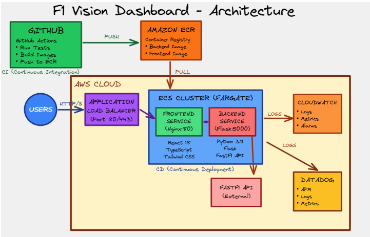

The F1 Data Insights project aims leverages the FastF1 Python API to provide users with comprehensive Formula 1 data with strong emphasis on DevSecOps practices.

## Architecture



## Features

- **Driver Standings** - Current championship standings with points and wins
- **Latest Race Results** - Results from the most recent Grand Prix
- **Race Calendar** - Complete season schedule with race dates and locations
- **Statistics Overview** - Key F1 statistics including total races, championships, active drivers, and fastest lap times
- **Modern UI** - Beautiful, responsive design with smooth animations

## Tech Stack

### Frontend

- React 18 with TypeScript
- Vite for fast development
- React Query for data fetching
- Tailwind CSS for styling
- Shadcn/ui components
- React Router for navigation
- Node.js 18+

### Backend

- Python 3.11
- Flask for REST API and Flask-CORS for cross-origin requests
- FastF1 API for F1 data 
- Pandas for data manipulation


## How to run Without DOCKER

### Backend Setup

1. Navigate to the backend directory:

```
cd backend
```

2. Create a virtual environment (recommended):

```
python -m venv venv
```

3. Activate the virtual environment:

   - Windows:
     ```bash
     venv\Scripts\activate
     ```
   - Linux/Mac:
     ```bash
     source venv/bin/activate
     ```

4. Install dependencies:

```
pip install -r requirements.txt
```

5. Run the backend server:

```
python app.py
```

The backend will start on `http://localhost:5000`

**Note**: FastF1 will cache data in a `./cache` directory. The first time you request data for a season, it may take some time to download and cache the data.

### Frontend Setup

1. Navigate to the frontend directory:

```
cd frontend
```

2. Install dependencies:

```
npm install
# or
yarn install
# or
bun install
```

3. Start the development server:

```bash
npm run dev
# or
yarn dev
# or
bun run dev
```

The frontend will start on `http://localhost:8080`

## API Endpoints

The backend provides the following REST API endpoints:

- `GET /` - API information
- `GET /api/results/latest?season=2024` - Get latest race results
- `GET /api/standings/drivers?season=2024` - Get driver championship standings
- `GET /api/standings/constructors?season=2024` - Get constructor championship standings
- `GET /api/calendar?season=2024` - Get race calendar for a season
- `GET /api/stats/overview?season=2024` - Get overview statistics
- `GET /api/races/<season>/<round>` - Get detailed race information
- `GET /api/driver/<driver_abbr>` - Get detailed driver profile and statistics

## Project Structure

```
f1-vision-dashboard/
├── backend/
│   ├── app.py              # Flask application
│   ├── requirements.txt    # Python dependencies
│   ├── Dockerfile         # Docker configuration
│   └── cache/             # FastF1 cache (created automatically)
├── frontend/
│   ├── src/
│   │   ├── components/    # React components
│   │   ├── pages/         # Page components
│   │   ├── services/      # API service
│   │   └── ...
│   ├── package.json       # Node dependencies
│   └── ...
└── README.md
```

## Development

### Backend Development

The backend uses Flask's debug mode for development. To run with debug mode:

```bash
python app.py
```

The backend will automatically reload on code changes.

### Frontend Development

The frontend uses Vite for hot module replacement. Changes will be reflected immediately in the browser.

## Data Source

This application uses the [FastF1](https://github.com/theOehrly/Fast-F1) library, which provides access to Formula 1 timing data and results. FastF1 uses the official F1 API and Ergast API to fetch data.

## How to Run with Docker

### Quick Start (Recommended)

The easiest way to run the entire application is using Docker Compose:

```bash
# Build and start all services (backend + frontend)
docker-compose up --build

# Or run in detached mode (background)
docker-compose up -d --build
```

Once started, access the application:
- **Frontend**: http://localhost
- **Backend API**: http://localhost:5000/api

To stop the containers:
```bash
docker-compose down
```

To view logs:
```bash
# All services
docker-compose logs -f

# Specific service
docker-compose logs -f backend
docker-compose logs -f frontend
```

### Running Individual Services

#### Backend Only

```bash
cd backend
docker build -t f1-backend .
docker run -p 8000:8000 f1-backend
```

#### Frontend Only

```bash
cd frontend
docker build -t f1-frontend .
docker run -p 80:80 f1-frontend
```

**Note**: If running frontend separately, make sure the backend is accessible at `http://localhost:8000/api` or update the nginx configuration.

### Docker Compose Services

The `docker-compose.yml` file includes:
- **Backend**: Flask API on port 5000
- **Frontend**: React app served by Nginx on port 80
- **Volume**: Persistent cache for FastF1 data (`./backend/cache`)
- **Health Checks**: Automatic health monitoring for both services

For more detailed Docker deployment information, see [DOCKER_DEPLOYMENT.md](DOCKER_DEPLOYMENT.md).


## Acknowledgments

- [FastF1](https://github.com/theOehrly/Fast-F1) for providing F1 data access
- [Ergast API](http://ergast.com/mrd/) for historical F1 data
- Formula 1 for the official timing data
